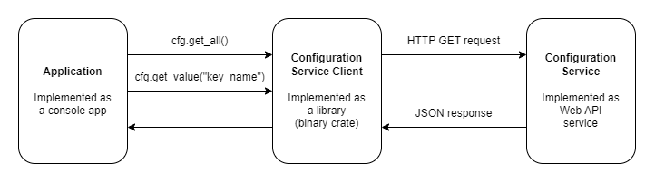

#### Application

Application loads configuration from a remote service via client:

```
let url = "http://localhost:5000";
let app_name = "MyApp";
let environment_name = "DEV"
let cfg = configuration_client::new(url, app_name, environment_name);
```

Get all configuration values as a HashMap of <string, stiring>

```
let all = cfg.get_all();
```

Get a single string value

```
let timeout = cfg.get_value("timeout");
```

#### Service Client

Service client hides all communication details from the Application and exposes 2 methods, "get_all" and "get_value".
Service client is implemented as a binary crate which can be reused by other applictaions.

#### Service

Service keeps configuration data as a collection of <string, string> Key/Value pairs.
Data is partitioned by application name and environment name.
Data is stored in memory collection and pre-seeded(for simplicity)

---

#### Nice to have

String to type conversion via generic parameter and default value

```
let timeout = cfg.get_value<u8>("timeout", 20); // not sure what correct Rust syntax is
```

#### Advanced workshop ?

Use real database/ORM instead of in-memory collection
Replace JSON with GRPC
Encrypt data on the server
Enable POST/PATCH endpoint, protected by API key
